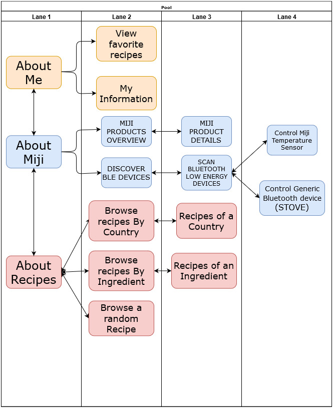
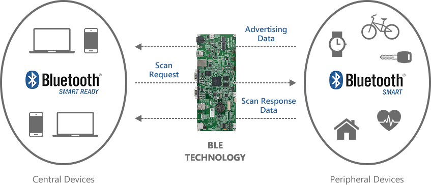
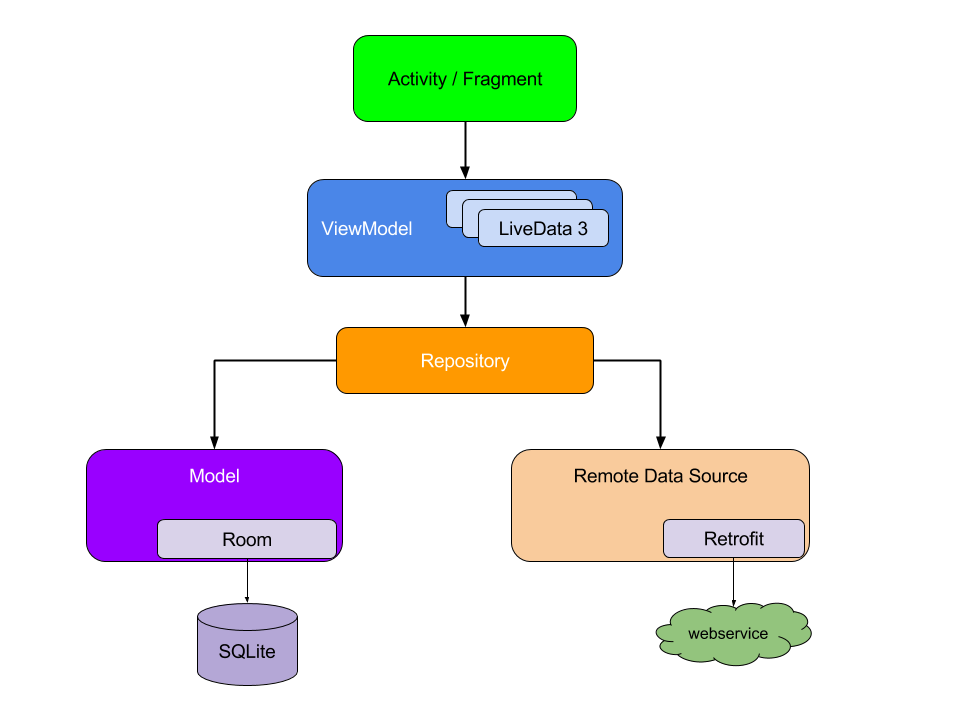
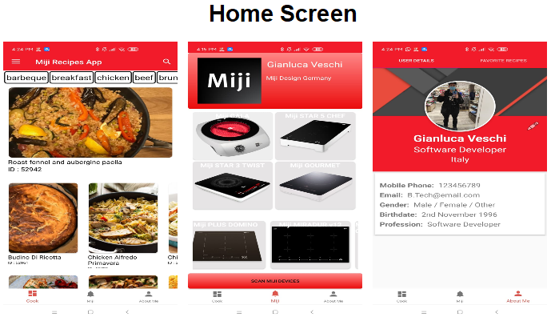

###### 2020 MIJI DESIGN GERMANY

# Mobile Application Development Report

## Gianluca Veschi

Miji Design Germany  
Shanghai, China – Hamburg, Germany  
February 2020  

## 1 Internship Introduction and statement of goals.

As part of a collaboration between the University for applied sciences HAW Hamburg and the University
of Science and Technology of Shanghai (USST) I have had the opportunity to work as a software
developer Intern at Miji Design Germany, a company specialized in the manufacturing of electric stoves
and hobs.

As soon as I arrived in the offices of Miji in Shanghai I have received the task of working at the
development of a new mobile application. Initially I have been given the code of the old version of the
official Miji App so that I could study it and gain inspiration from the development done and the
challenges encountered.

The former official Miji App had been written by a Chinese subcontractor and there could not be any
internal communication between me and the developers who had done the project, furthermore they
had used a framework which is only used in China (CrossApp), therefore I couldn't continue from where
they started.

I came out with the Idea for a new App, whose project will be explained in detail in the following
documentation.

## 2 Project Overview 项目概况

### ● About Recipes

The user is able to scroll through different types of recipes and categories of food. When clicking
on one of them, information about the Ingredients, Recipe and other details is shown. The
information shown here is retrieved by a server so the Internet connection Is Necessary at first.
Once the user clicks on a Recipe this gets saved in the internal cache of the phone, so that it can
also be seen offline without having a connection to the server.  

### ● About Miji

#### Stove Control


The user is able to connect the phone to the Temperature Sensor of Miji and see the
temperature on the screen. In a future development the user can also connect the device to the
cooking stove and set the time and temperature. This goal has not been fully accomplished to
the outbreak of COVID-19, which caused my early departure from China.

#### Products Overview


The user is able to scroll through the products of the company. When clicking one of the them,
Images, description, price and other details are shown.

### ● User Overview

The user can set his password and details. Here he can also see the recipes saved to his phone.


```
Figure 1. : Activity Flow Diagram
```

## 3 Subsystems Overview

### ● About Miji (AboutMijiActivity.java):

This is the starting point for the application. On this View the user is presented with some of the
products of the company such as Stoves and Hobs. The pictures and descriptions are mostly for
test purposes as the data is directly saved inside the application and not retrieved from a server.
A more detailed design would require a API connection with the official MIJI website, where the
products details are already available.  
  
On the same view there is a button which Scans for “Bluetooth Low Energy devices”, more
specifically the “Miji Thermometer”. The button brings the user to the MainBluetoothActivity,
which internally contains an instance of BleScanner. This is the object responsible for requiring
permission from the User to activate the BT and start the scanning mode, which finally returns
the found devices and displays them in List. For test purposes, all BLE devices in the area are
found but there is also a filter setting which only targets the MAC of the Miji thermometer.
  
Once the Thermometer is found, the app can connect to it and automatically start receiving the
measurement. The process behind it is well documented in the code but basically the
ControlPeripheralActivity binds itself to the BleAdapterService, which can run in background and
discover the services offered by thermometer and “subscribe” to their descriptors.
  
The Bluetooth package inside the software is also able to log the Services, Characteristics and
Descriptors of any BLE device. For a more detailed description of the BLE stack it is advised
to look up the Documentation on the official website :
https://developer.android.com/guide/topics/connectivity/bluetooth-le



```
Figure 2. : Bluetooth Low Energy Technology
```

### ● About Recipes (AboutMealsActivity.java):


According to my competitor's analysis, the users do not only want an App to control 
their personal device but also a space from where they can get Inspiration about recipes
and meals according to their tastes. For this reason I put a big focus on this activity
component.

The User is shown a set of four different horizontal lists, implemented as RecyclerViews.
On the top the user can scroll through different categories. (In a future update the
feature to customize this list could be easily added). By tapping on a category the app
jumps to the “BrowseRecipesByCategoryActivity.java”, where a list of recipes is shown
and the user can pick up its favourite one and save it among its favourites.

The same design is applied to the central layout, which is filled with other RecylerViews
showing different types of meals with two different styles, respectively Vertical and
Horizontal View Holders. In particular this set of meals is retrieved randomly from the
ones available in the databases. This is done to simulate the behaviour of a real application, 
where the content is often updated.

A handy drawer layout can be accessed by swiping from left to right or by tapping on
the “hamburger” Icon on the top left corner, as it is the norm according to Android
documentation. Here the user can choose among Recipes by Category, Nationality, Main
Ingredient or also pick a random meal.

### ● About User (AboutMeActivity.java):

This Activity consists of two fragments, namely FavoriteRecipesFragment.java and
UserDetailsFrament.java. In the first one the user can set his Username, Picture and other
details. By swiping to the right the recipes saved into the phone are shown.

## 3.1 Disadvantages of the previous application

Miji's old Application basically has the great advantage to be written in C++, which means the same
code is valid for both iOS and Android, but this also presents big disadvantages as non native
development is by definition not optimal for ones's specific operative system.

Here is a list of the points which should be improved or are not optimal:

- The user can connect the phone to the Stove but can only see the power consumption and the
    temperature and not really interact with the product.
- There are only a few recipes from which the user get inspiration but they are always the same
    and never change. This bores the user and doesn't make him want to use the app.
- Poor Design. Pictures get distorted when one clicks on them.
- The App is heavy (267MB). In comparison aKitchen is (3MB). Reason is, the images are not saved
    in a server but in the phone.
- The App is not “scalable”. The code is commented in Chinese, written with a technology that is
    obsolete.
- New Users cannot register.

## 3.2 Advantages of the new application

During my short stay of five Months at Miji, I tried to tackle some of the problems and this is what I
achieved :

- The user can receive the temperature signal from the sensor in just one click.
- The recipes displayed are not saved in the app itself, instead they are retrieved from two
    different open databases. (In the future Miji should think about creating its own database and
    also allow users to input their own recipes, which could be also graded and be commented by
    other users in order to create a community of people who all share enthusiasm for the same
    brand).
- The design makes use of better themes and colours although a new layout design created by a
    proper front-end designer is definitely needed in the future.
- The app is light-weight, but it still requires a lot of work to be fast as other competitors.
- The code is highly scalable, It makes use of the MVVM internal architecture which is easy to
    understand and maintain. Most important, it is commented in English.

## 4 Back-end Development 后端开发

- **Web Server :**
    The data is retrieved by two different databases, namely [http://www.themealdb.com](http://www.themealdb.com) and
    https://recipesapi.herokuapp.com. Both Databases are free to use for development purposes
    but they are not suitable for production.
    The data can be accessed trough their internal APIs, which in both cases provides a .JSON file
    but being the two Databases totally different there are also two different implementations,
    which is then mapped to a two different Models, referred to respectively as “Meal” and
    “Recipe”.
    For learning purposes I have used Both Google's VOLLEY Library and the more common
    RETROFIT2. They behave in a similar fashion but have different implementations. The first
    directly accesses the JSON file from the Java code whereas the latter provides an Interface to
    interact with a POJO model related to the .JSON file. Internally the HTTP requests are handled
    by OkHttp3.
    Images are then displayed to the user with both the PICASSO and GLIDE Library. The latter also
    supports a caching system which automatically saves the data in the user's phone.


- **Software architectural pattern :**

The whole business logic could be totally implemented inside the Activity without problems but
a structured arrangement is optimal for debugging and better understanding the workflow of
the application.
The data is organized according to the MVVM Pattern. The reason why I chose this approach is
because of its compartmentalization of the various components in a project.
- The UI components are kept away from the business logic
- The business logic is kept away from the database operations
- It's easy to read (because everything has specific places to live)

As a brief explanation there are different stages where the information flows before arriving to
the Activity where it is displayed.
ViewModels can tell other components to retrieve data (for example a repository), and it can
handle incoming requests from a user to modify the data. It is both suitable for Activities and
fragments and basically separates the act of retrieving or updating data sets.
Repositories are mediators between different data sources, such as persistent models, web
services, and caches. They are literally hubs for incoming and outgoing data.
Notice that each component depends only on the component one level below it.



```
Figure 3. : MVVM Structure
```


- **Database :**
    In order to store the data in a structured way, once a user clicks on a Recipe, the data is cached
    into the phone, so that the user doesn't need to always have an active Internet connection. The
    implementation is not directly done with SQL but instead with the ROOM Framework, which
    eases the development and debugging for the programmer.
    Once the data is downloaded from the Internet, the application caches it to the phone with a
    timestamp, internally we could decide to check this timestamp weekly , daily or anything
    wanted. For learning purposes I played around with this parameter according to my own needs
    as the data in the databases actually never change.
- The application also respects the “single responsibility principle”, in fact the Repository, which is
    the class responsible for returning the data to the ViewModel and consequently to the
    Activities, doesn't know where if the data comes from the Database or the Network. This
    information is of course logged to the console for debugging


## 7 Screenshots

```
Figure 4 : Bottom Navigation bar
```

## 8 Conclusion

It has been a pleasure for me to work at Miji and to challenge my own knowledge about programming
while at the same time learning about project development and planning by doing. It has indisputably
been a very valuable experience and I'll be ready to help the ones who are going to take my place in the
future.

Gianluca Veschi

## 9 Credits
CodingWithMitch.com
CodingInFlow.com


